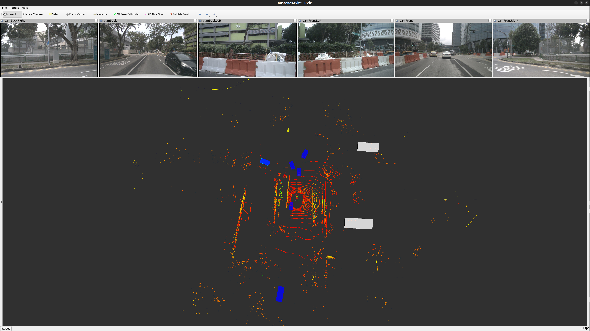

# CenterPoint-ROS-Detection-and-Tracking

## Environment

- Hardware
  - GPU Nvidia RTX4060
- Software
  - Ubuntu 20.04
  - ROS noetic
  - TensorRT 8.6.1.6
  - CUDA 11.8
  - cuDNN 8.9.7

[](https://github.com/JYS997760473/CenterPoint-ROS-Detection-and-Tracking/assets/90627672/44d2b523-8af9-4b98-b2cb-fce8485630b6)

## Build

- Please First Update your `TensorRT` `include` and `library` path in `CMakeLists.txt`'s line 32 (`TENSORRT_INCLUDE_DIRS`) and 33 (`TENSORRT_LIBRARY_DIRS`).

```bash
cd <your catkin_workspace>/src
git clone git@github.com:JYS997760473/CenterPoint-ROS-Detection-and-Tracking.git
catkin build centerpoint_detection
```

## Perpare nuscenes rosbag

-  Recommand generate nuscenes rosbag from [nuscenes2bag](https://github.com/clynamen/nuscenes2bag).

Or can download a demo rosbag from [Google Drive](https://drive.google.com/file/d/1yPDBtFXA3paHSVg264Q_LgurgCEk4tW5/view?usp=sharing)

## Detection

### Run

```bash
roslaunch centerpoint_detection_and_tracking centerpoint_detection.launch
```

```bash
rosbag play <rosbag.bag>
```

## Detection and Tracking

```bash
roslaunch centerpoint_detection_and_tracking centerpoint_detection_and_tracking.launch
```

```bash
rosbag play <rosbag.bag>
```

## Reference

[CUDA-CenterPoint](https://github.com/NVIDIA-AI-IOT/Lidar_AI_Solution/tree/master/CUDA-CenterPoint)

[nuscenes2bag](https://github.com/clynamen/nuscenes2bag)

[AutoLidarPerception](https://github.com/AutoLidarPerception)
